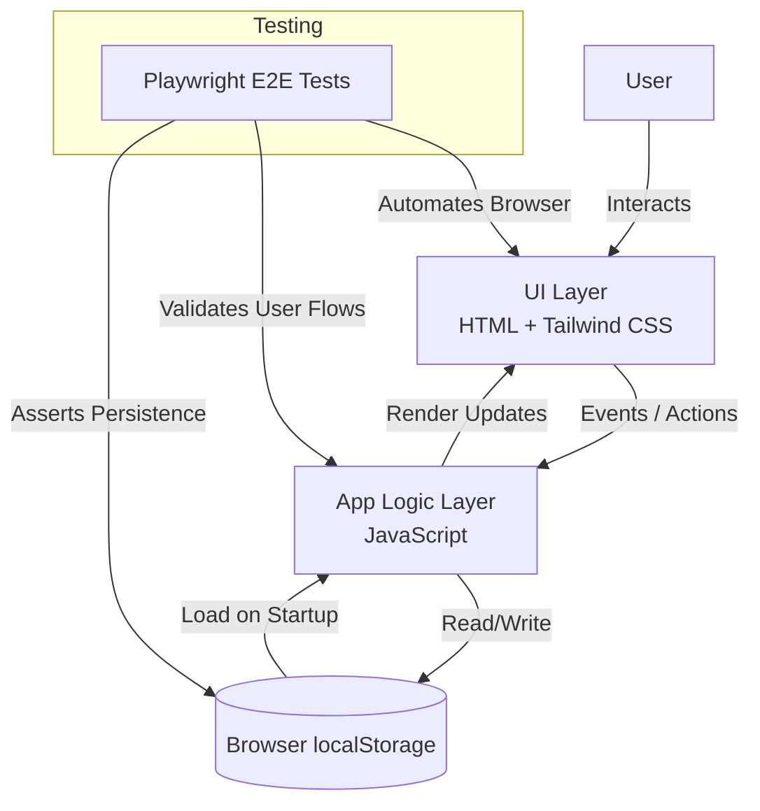

# Kunj's Personal Reminder App

A modern, AI-inspired reminder application with a clean, responsive UI and a fast, reliable experience. Built with **HTML**, **Tailwind CSS**, and **JavaScript**, it persists data using **localStorage** and is validated with **Playwright** end-to-end tests.

---

## About

**Kunj's Personal Reminder App** is a lightweight, front-end reminder tool designed for simplicity and speed. It delivers a polished, app-like interface while keeping the stack intentionally minimal—no backend required. Reminders are stored locally in the browser, making it easy to use instantly and ideal for showcasing strong fundamentals in UI engineering, state management, and automated testing.

---

## Features

- **Create, view, update, and delete reminders**
- **Persistent storage with localStorage** (data remains after refresh/close)
- **Responsive UI** powered by Tailwind CSS
- **Fast, lightweight, no-backend architecture**
- **End-to-end tested with Playwright** for reliability and regression prevention

---

## Tech Stack

- **HTML** – Structure and layout  
- **Tailwind CSS** – Modern styling and responsive design  
- **JavaScript (Vanilla)** – App logic, state handling, DOM updates  
- **localStorage** – Client-side persistence  
- **Playwright** – End-to-end testing framework  

---

## Architecture (High-Level)



**How it works (at a glance):**
- The **UI layer** captures user actions (add/edit/delete).
- **JavaScript app logic** updates in-memory state and re-renders the UI.
- State is persisted to **localStorage** so reminders survive refreshes.
- **Playwright** validates real user journeys end-to-end in a browser context.

---

## Project Structure

> File/folder names may vary slightly depending on your setup, but the project typically follows this layout:

- `index.html` — App shell and UI entry point  
- `assets/` — Static assets (icons/images, if any)  
- `styles/` — Additional styles (if applicable alongside Tailwind)  
- `scripts/` (or similar) — JavaScript logic (CRUD, rendering, storage sync)  
- `tests/` — Playwright E2E test suite  
- `playwright.config.*` — Playwright configuration  

---

## Getting Started

### Prerequisites
- A modern browser (Chrome, Edge, Firefox)
- (Optional for testing) **Node.js** + **npm**

### Run the App
Because this is a front-end app, you can open it directly, but using a local server is recommended.

#### Option A: Open directly
- Open `index.html` in your browser.

#### Option B: Run via a local server (recommended)
Example using VS Code:
1. Install **Live Server**
2. Right-click `index.html` → **Open with Live Server**

---

## Testing

This project uses **Playwright** for end-to-end tests.

### Install dependencies
```bash
npm install
```

### Install Playwright browsers
```bash
npx playwright install
```

### Run tests
```bash
npx playwright test
```

### View the HTML report (if enabled)
```bash
npx playwright show-report
```

---

## Future Enhancements

- Reminder **due dates & time-based scheduling**
- **Notifications** (browser notifications / alarms)
- **Search, filters, and sorting** (priority, due date, status)
- **Recurring reminders**
- **Tags / categories**
- Optional sync: **cloud persistence / auth**
- Accessibility improvements (keyboard navigation, ARIA refinements)
- Export/import reminders (JSON)

---

### License
Add a license if you plan to make this project reusable by others (e.g., MIT).

---

**Built by Kunj Maheshwari** — a clean, practical project demonstrating modern UI craft, client-side persistence, and automated E2E testing.
